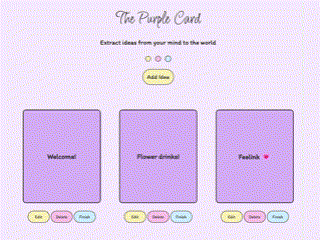
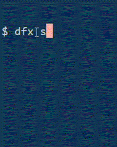
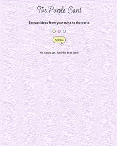
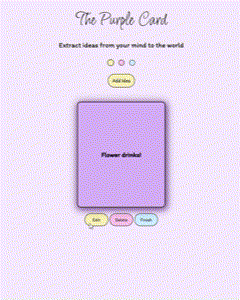
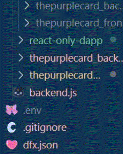

# The Purple Card <💜💭/>

Capture every fleeting thought on a purple card so it doesn't get lost and can come true one day!💡💜 

The app is built on **React** for the frontend, with some magical backend logic using **Motoko** on **DFINITY's Internet Computer** 🧠💻

Before this full-stack DApp came together, I first built the frontend with **React**. Check out the **exciting phases** of the frontend development in my [React Frontend Repository](https://github.com/aysha-alfasi/The-purple-card-frontend/commits/master/)🎨. That’s where the journey began!

In this repo, you’re exploring the full-stack experience! 🌟  

## visual overview 🍓 

## languages 💻  

HTML, CSS, JavaScript, Motoko

## Libraries & Tools ⭐  

ReactJs, sweetalert2, Howler.js (sound effects), DFINITY (dfx), Motoko

## Features 🌟 

1.  Add a new idea card  💌
2.  Edit or delete any idea 🤍 
3.  Celebration popup with sound on completion 🎉
4.  Interactive sound effects to enhance user experience 🔊✨
5.  Playful and engaging UX with creative feedback for empty input or errors 💬

## Visual Example of running the application locally 🌟

## Visual Example of Adding new card  🌟 

## Visual Example of the UX for Edit, Delete, and Finish buttons🌟 

## Visual Example of testing error handling 🌟  

## Backend power 💫  

The backend canister is written in Motoko and deployed via `dfx` locally 🚀

## Last note 🌼  
**This is one of my most playful and interactive apps 🍒🎈**

### Thanks for reading ♡ ⋆｡˚
